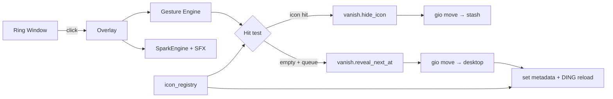
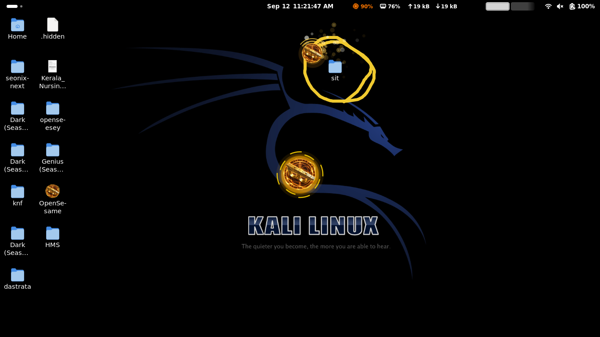
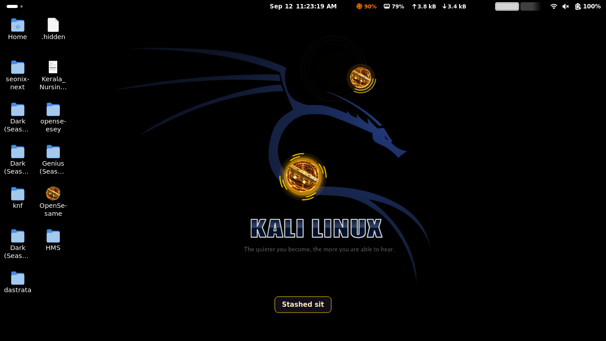
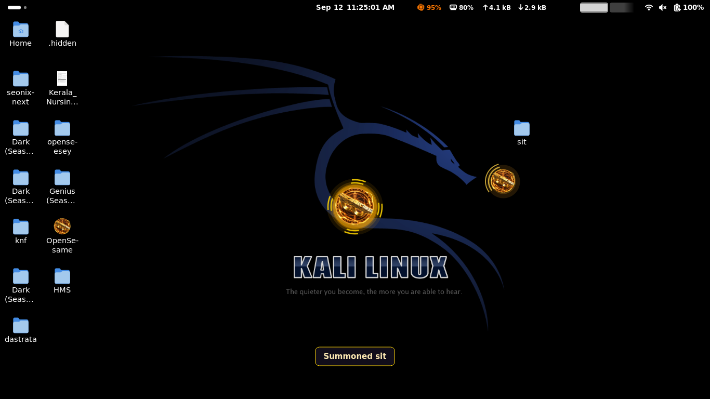

# OpenSesame — Doctor Strange Desktop Deportation 🎯

A Linux desktop toy that turns your mouse into a sling ring. Circle an icon to stash it off-screen, circle empty space to summon it back at your portal, and press **Esc** to restore everything. Golden sparkles and a portal chime included — because magic should be loud.


## Basic Details

### Team Name: OpenSesame

### Team Members
- **Team Lead:** Jagannath P S — College of Engineering Munnar
- **Member:** Emmanuel Biju — College of Engineering Munnar

### Project Description
OpenSesame is a PySide6 overlay app for GNOME/KDE desktops using **DING (Desktop Icons NG)**. Click the floating ring to arm sling mode, draw a circle around a desktop icon to hide it (and copy its path to the clipboard), then draw a circle on empty desktop space to summon the oldest stashed icon exactly where you drew — FIFO queue, portal placement, sparkle effects, and sound.

### The Problem (that doesn't exist)
Your desktop is *too honest*. Icons just sit there, visible, obeying physics and file systems. There is no mystical deportation dimension, no sling ring, and no satisfying *whoosh* when a PDF vanishes because you drew a circle like a discount sorcerer supreme.

### The Solution (that nobody asked for)
We built a useless-but-delightful **Doctor Strange deportation engine**: a golden ring cursor, circle-gesture detection, GIO-powered icon stash/summon, DING grid placement at your portal, golden particle bursts, and an MP3 chime — so your homework can disappear into `~/.local/share/opensesame/stash/` and reappear where you drew your portal. **Esc** brings everyone home. You're welcome.

## Technical Details

### Technologies/Components Used

**For Software:**
- **Languages:** Python 3.13+
- **Frameworks:** PySide6 (Qt6 widgets, multimedia, overlay window)
- **Libraries:** GIO (`gio` CLI), GNOME Extensions API, Desktop Icons NG (`ding@rastersoft.com`)
- **Tools:** `gnome-extensions`, Python `venv`, Gio.FileMonitor (desktop watch)

**For Hardware:**
- Any Linux machine with a graphical desktop (tested on Kali / GNOME)
- Mouse or trackpad (for drawing circles — wand not included)
- Speakers (optional, for portal chime)

### Implementation

**For Software:**

#### Prerequisites
- Linux with **DING** desktop icons extension enabled
- Python 3 and `venv`
- `gio` and `gnome-extensions` in PATH

#### Installation

```bash
cd openseesey
python3 -m venv .venv
.venv/bin/pip install -r requirements.txt
bash install_desktop.sh
```

This creates a virtual environment, installs PySide6, and adds an **OpenSesame** launcher to your app menu and `~/Desktop`.

#### Run

```bash
cd openseesey
.venv/bin/python main.py
```

Or double-click **OpenSesame** on the desktop.

#### Controls
| Action | Result |
|--------|--------|
| Click ring | Arm / disarm sling overlay |
| Circle around icon | Stash icon + copy path to clipboard |
| Circle on empty space | Summon oldest stashed icon at portal (FIFO) |
| **Esc** (while armed) | Restore all stashed icons + exit sling mode |
| **Esc** (while disarmed) | Quit app |
| **Ctrl+Q** | Quit app |

### Project Documentation

**For Software:**

#### Architecture



*User draws a circle → gesture engine validates it → hit tester picks icon vs empty space → vanish stashes or restores via GIO, with DING reload for portal placement.*

#### Screenshots


*The floating sling ring — click to enter portal mode.*


*Golden overlay armed: draw circles to stash or summon desktop icons.*


*Circling an icon stashes it off the desktop with sparkle effects and chime.*


*Circling empty space summons the next stashed icon at the portal centroid.*

#### Key modules

| File | Role |
|------|------|
| `main.py` | App entry, ring + overlay wiring |
| `overlay.py` | Fullscreen gesture overlay, async summon |
| `ring_window.py` | Floating sling ring launcher |
| `vanish.py` | Stash / restore FIFO queue via GIO |
| `icon_registry.py` | DING reload, grid placement, icon positions |
| `hit_tester.py` | Circle centroid vs desktop icon hit test |
| `gesture_engine.py` | Circle gesture detection |
| `sparks.py` | Golden sparkle trail and burst effects |
| `sfx.py` | Portal chime (`AUD-20260912-WA0000.mp3`) |

**For Hardware:**

*N/A — software-only project.*

### Project Demo

#### Video
**[OpenSesame Demo — demosesame](https://drive.google.com/file/d/1yv2HwmLQF_Zd9I7RgkuONHWc1xpwDJqo/view?usp=sharing)**

*Demonstrates arming the sling ring, stashing a desktop icon, summoning it at a portal circle, sparkle effects, chime, and Esc restore.*

#### Additional Demos
- Live demo on Kali Linux with DING desktop icons
- Audio: portal chime plays on every accepted circle gesture

## Team Contributions
- **Jagannath P S (Team Lead):** Project lead, architecture, core development, DING/GIO integration, icon placement logic, and desktop stash/restore pipeline
- **Emmanuel Biju:** UI/UX, sparkle effects, sound integration, testing, and documentation

---
Made with ❤️ at TinkerHub Useless Projects 


